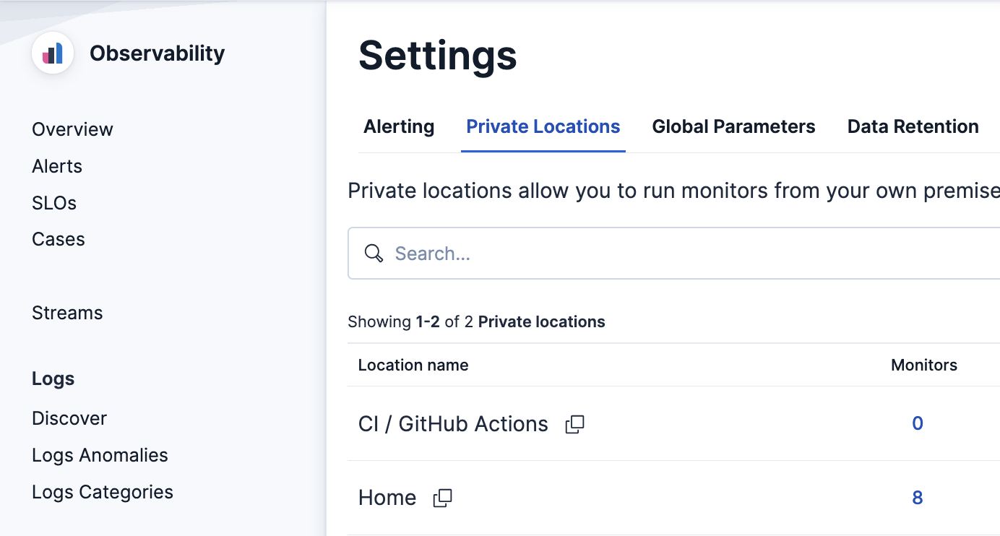

# synthetics-es-pusher

Push `@elastic/synthetics` browser journey results directly into Elasticsearch — bypassing Heartbeat and Elastic Agent entirely — while remaining fully visible in the native Kibana Synthetics UI.

## Table of contents

- [Why this exists](#why-this-exists)
- [Requirements](#requirements)
  - [Elastic stack](#elastic-stack)
  - [Local / CI runner](#local--ci-runner)
  - [One-time Kibana setup](#one-time-kibana-setup)
- [Quickstart](#quickstart)
- [Configuration](#configuration)
- [Project structure](#project-structure)
- [How it works](#how-it-works)
- [What Kibana shows](#what-kibana-shows)
- [Expected output](#expected-output)
- [Known limitations](#known-limitations)

---

## Why this exists

The standard Elastic Synthetics stack requires deploying and managing a Fleet-managed Elastic Agent with a Synthetics integration. That creates friction in several real-world scenarios:

1. **No agent available** — you want to run browser journeys from an environment where installing and enrolling an Elastic Agent is not feasible (a locked-down server, a developer machine, a container with restricted networking).

2. **CI/CD integration** — you want to run journeys as part of your pipeline (GitHub Actions, GitLab CI, Jenkins…) and push results to Elastic without provisioning a persistent agent or dealing with Fleet enrollment.

3. **Decoupled architecture** — you want the journey runner and the Elastic stack to be fully independent. The runner needs only an Elasticsearch API key; no Fleet, no Agent policy, no integration package to manage. You control the run schedule, the runner version, and the infrastructure.

4. **Custom environments** — you need to run journeys from behind a firewall, on a specific network segment, or from hardware that Elastic Agent does not support.

The trade-off: you register a **private location** in Kibana once (a one-time 2-minute setup), then run journeys from anywhere. Results appear in the Kibana Synthetics UI with full step timings, network waterfall, screenshots, and the 24h status chart — indistinguishable from Agent-managed monitors.

---

## Requirements

### Elastic stack

- Elasticsearch + Kibana (Cloud or self-managed, 8.x+)
- An API key with write access to `synthetics-*` data streams
- A **Kibana private location** (see [One-time Kibana setup](#one-time-kibana-setup) below)

### Local / CI runner

- Node.js 18+
- `npm install` — installs `@elastic/synthetics` locally (no global install, no Homebrew)
- `npx @elastic/synthetics install-chromium` — downloads the Chromium build pinned to this version of Playwright; must be run once per machine or CI runner image

### One-time Kibana setup

#### Step 1 — Create a Fleet agent policy

The Synthetics private location API requires a Fleet agent policy as a backing object, even though no real agent will ever enroll in it. Create a minimal one via **Kibana Dev Tools**:

```json
POST kbn:/api/fleet/agent_policies
{
  "name": "Synthetics - CI",
  "namespace": "default",
  "description": "Backing policy for synthetics-es-pusher private location",
  "monitoring_enabled": ["metrics"]
}
```

Save the returned `id` (e.g. `cb962dc4-9fae-4341-a989-5bac9d73356c`).

#### Step 2 — Create the private location

The `/api/synthetics/private_locations` endpoint validates that the location's spaces are contained in the agent policy's spaces, which blocks creation when both are empty. Bypass it by writing directly to the saved objects API:

```json
POST kbn:/api/saved_objects/synthetics-private-location
{
  "attributes": {
    "label": "CI / GitHub Actions",
    "agentPolicyId": "<policy-id-from-step-1>",
    "geo": { "lat": 48.8566, "lon": 2.3522 },
    "namespace": "default",
    "spaces": ["*"]
  }
}
```

Save the returned `id` — this is your `<location-id>`.

Verify it appears in **Observability → Settings → Private Locations**:



The value in the **Location name** column is exactly what you set as `MONITOR_LOCATION_NAME` in your `env` file.

#### Step 3 — Create a browser monitor attached to that location

```json
POST kbn:/api/synthetics/monitors
{
  "type": "browser",
  "name": "My Monitor",
  "schedule": { "number": "10", "unit": "m" },
  "locations": [
    {
      "id": "<location-id-from-step-2>",
      "label": "CI / GitHub Actions",
      "isServiceManaged": false
    }
  ],
  "inline_script": "step('placeholder', async () => {})"
}
```

Save the returned `config_id` — this is your `MONITOR_ID`.

---

## Quickstart

```bash
# 1. Install dependencies (includes @elastic/synthetics + Playwright)
npm install

# 2. Download Chromium (required once per machine / CI runner)
npx @elastic/synthetics install-chromium

# 3. Configure
cp env.example env
# Edit env: set ES URL, API key, MONITOR_ID, MONITOR_LOCATION_NAME

# 4. Source config and run
set -a && source env && set +a
node run-journey.mjs example.journey.js
```

Results appear in Kibana at **Observability → Synthetics** within seconds.

---

## Configuration

Source the `env` file before running:

```bash
set -a && source env && set +a
```

| Variable | Required | Description |
|---|---|---|
| `SYNTHETICS_ES_URL` | ✅ | Elasticsearch endpoint |
| `SYNTHETICS_ES_KEY` | ✅ | API key (write access to `synthetics-*`) |
| `KIBANA_URL` | | Kibana endpoint (for setup scripts only) |
| `MONITOR_ID` | ✅ | `config_id` returned by Kibana when the monitor was created |
| `MONITOR_NAME` | ✅ | Display name shown in Kibana |
| `MONITOR_SCHEDULE` | | Run interval in minutes (default: `10`) |
| `MONITOR_LOCATION_NAME` | ✅ | Must match the private location label in Kibana exactly |
| `MONITOR_LOCATION_GEO` | | Coordinates `"lat, lon"` (display only) |
| `MONITOR_SPACE` | | Kibana space (default: `default`) |
| `MONITOR_TAGS` | | Comma-separated tags |
| `MONITOR_SERVICE` | | `service.name` for APM correlation |
| `SYNTHETICS_HEADLESS` | | Set to `false` for headed (visible browser) debug mode (default: `true`) |
| `SYNTHETICS_SCREENSHOTS` | | `on`, `off`, or `only-on-failure` (default: `on`) |
| `SYNTHETICS_AGENT_VERSION` | | Heartbeat agent version in ES envelope (default: `9.1.0`) |
| `SYNTHETICS_ES_DEBUG` | | Set to `true` for verbose ES output |

---

## Project structure

```text
synthetics-es-pusher/
├── run-journey.mjs      # Entry point — programmatic runner with ESReporter
├── es-reporter.mjs      # Custom reporter: hooks into @elastic/synthetics lifecycle
├── transform.mjs        # Maps reporter events to ES documents
├── es-client.mjs        # Minimal _bulk client (native fetch, no SDK)
├── constants.mjs        # Shared constants (versions, data stream names)
├── push-results.mjs     # Alternate: transform NDJSON from --reporter json
├── test-pipeline.mjs    # Dry-run / push test without a real browser
├── example.journey.js   # Sample journey
└── env.example          # Environment variable template
```

---

## How it works

`run-journey.mjs` uses the `@elastic/synthetics` programmatic API (`run()`) and passes `ESReporter` directly as the reporter class — bypassing the CLI's allowlist that blocks custom reporters when using the Homebrew or global binary.

`ESReporter` hooks into the runner lifecycle (`onJourneyStart`, `onStepEnd`, `onJourneyEnd`) and pushes documents to Elasticsearch via `_bulk` in real time. Documents pushed per run:

| Doc type | Data stream | Purpose |
|---|---|---|
| `journey/start` | `synthetics-browser-default` | Run start marker |
| `step/end` | `synthetics-browser-default` | Step result, duration, page metrics |
| `step/metrics` | `synthetics-browser-default` | CDP performance traces (FCP, navigation marks) |
| `journey/network_info` | `synthetics-browser-default` | Per-resource network timing (DNS, TLS, wait, receive) |
| `journey/end` | `synthetics-browser-default` | Journey result |
| `heartbeat/summary` | `synthetics-browser-default` | Monitor status — required for Kibana Synthetics UI |
| `screenshot/block` | `synthetics-browser.screenshot-default` | Image tile deduplicated by content hash |
| `step/screenshot_ref` | `synthetics-browser.screenshot-default` | Block index for step screenshot reconstruction |

---

## What Kibana shows

- **Monitor status** (up/down) with 24h history chart
- **Per-run step detail**: step names, durations, status
- **Network waterfall**: DNS, connect, TLS, wait, receive per resource
- **Performance marks**: navigationStart, firstContentfulPaint, and other CDP events
- **Page metrics**: JS heap, node count, layout duration, script duration
- **Screenshots**: composite screenshot per step, reconstructed from content-hashed blocks
- **Monitor URL**: first URL visited in the journey, clickable from the monitor details panel

---

## Expected output

### 409 errors on screenshot blocks

When running the same journey multiple times you will see 409 errors in the output:

```text
[es-client] Bulk errors (24/65):
  409 — version_conflict_engine_exception: [38598688...]: document already exists
```

This is **normal and expected**. Screenshot blocks are indexed with `_id` equal to the SHA1 hash of their pixel content. If a screen region has not changed between runs, the hash is identical and Elasticsearch rejects the duplicate with a 409. The block is already stored — no data is lost. This is content-based deduplication: the same image tile is stored only once regardless of how many times you run the journey.

---

## Known limitations

- `event.agent_id_status` is not populated (Fleet field, not used by the Synthetics UI).
- Alerting works when the monitor was created via the Kibana API with the same `MONITOR_ID` — `check_group` and `config_id` must be consistent.
- The runner does not self-schedule; use cron, a CI schedule trigger, or a loop to run periodically.
